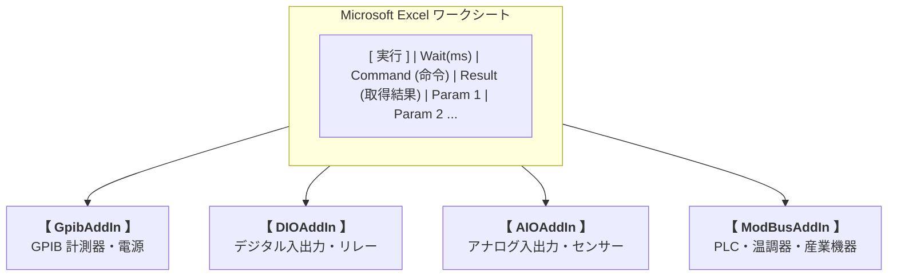

# Monacaアプリ工房 (Monaca App Store)

> **Excel を、すべての計測・制御・自動化の統合コンソールへ。**  
> 使い慣れた Excel のシート上に手順を記述するだけで、様々なデバイスや計測器をダイレクトにコントロールできる次世代 Excel VSTO アドインシリーズです。

---

## 💡 Monacaアプリ工房とは？

**Monacaアプリ工房** は、工場の自動検査、実験室での特性評価、研究開発におけるデータ収集を「誰もが簡単に・素早く」自動化できるように設計された計測制御ソリューションです。

VBA マクロのプログラミングや専用ツールの複雑な学習は不要です。**Excel シートのセルにコマンドやパラメータを書き込み、ボタンを押すだけ**で、各種ハードウェアとの通信から測定値のリアルタイム自動集計までをスムーズに実行できます。

---

## ✨ シリーズ共通のコア特長

1. **セル直結型シーケンス制御**
   * シート上の指定セルを起点として、実行ボタン・待機時間・コマンド・結果・パラメータ枠をワンクリックで自動生成。
   * 個別ステップの「単発実行」と、上から順に一気に流す「一括連続実行（Start）」を直感的に使い分けられます。
2. **測定データのリアルタイム・自動セル展開**
   * 機器から取得したデータは指定の結果セルへ即座に書き込み。波形データや多点計測値などの二次元配列データも、セル範囲へ自動展開されます。
3. **入力規則（ドロップダウン）の自動連動**
   * コマンド定義に設定された選択肢（レンジ設定や測定モード等）が、Excel の「データの入力規則」としてセルへ自動適用され、入力ミスを防ぎます。
4. **お好みスタイルの保存＆テンプレート化**
   * セルの背景色、罫線、フォント、列幅などをカスタマイズした上で「スタイル保存」を行えば、次回以降も自社標準のデザインでシーケンスを作成できます。
5. **統一された操作体系**
   * GPIB でも DIO でも、すべてのシリーズ製品で共通の UI 設計・リボン構成・データフォーマットを採用。1つのアドインを習得すれば、他のデバイス制御も迷わず導入できます。

---

## 🔌 製品ラインナップ

| 製品名 | 対象インターフェース / デバイス | ステータス | 評価期間 | 主な用途・特徴 | リンク |
| :--- | :--- | :---: | :---: | :--- | :---: |
| **GpibAddIn** | **GPIB (IEEE-488)** CONTEC / Interface 対応 | **公開中** | **〜2026/10/31** | デジタルマルチメータ、オシロスコープ、直流安定化電源、電子負荷などの自動測定・データ収集 | [詳細を見る](https://github.com/Monaca-App/GpibAddIn) |
| **DIOAddIn** | **Digital I/O (DIO)** 絶縁デジタル入出力カード等 | 近日公開 | 公開時に設定 | リレー制御、スイッチ状態検知、シリンダ動作制御、製造ラインのインターロック監視 | 準備中 |
| **AIOAddIn** | **Analog I/O (AIO)** A/D変換、D/A変換ユニット | 近日公開 | 公開時に設定 | 電圧・電流のリアルタイムロギング、各種センサ（温度・圧力・歪み）モニタリング、アナログ波形出力 | 準備中 |
| **TermAddIn** | **Serial / Terminal** RS-232C / UART / TCP | 近日公開 | 公開時に設定 | シリアル通信機器、組込みマイコンボード、バーコードリーダー、ターミナル機器制御 | 準備中 |
| **ModBusAddIn**| **Modbus Protocol** Modbus RTU / Modbus TCP | 近日公開 | 公開時に設定 | 各種 PLC、温調器、インバータ、電力計などの産業用オープンプロトコル機器制御 | 準備中 |

---

## 📦 ピックアップ製品詳細

### 🥇 GpibAddIn (GPIB 機器制御・自動計測)

電子計測のスタンダードである **GPIB（IEEE-488）** インターフェースに対応した主力アドインです。

* **マルチベンダー対応**: CONTEC 製ボード（`CGPIB.dll`）および Interface 製ボード（`GPC4304.dll`）の切り替えに対応。
* **動作シミュレーションモード**: 実機や GPIB ボードが手元にない開発用 PC でも、`DebugDLL` を有効にすることでシーケンスの作成・UI 連携テストが可能。
* **マクロスクリプト (CSV) 連携**: 機器コマンドやパラメータ仕様は可読性の高い CSV で定義。ChatGPT や Claude、Gemini 等の AI を用いて計測器マニュアルからマクロを自動生成できる指示書プロンプトも同梱。

👉 **[GpibAddIn の取扱説明・ダウンロードはこちら](https://github.com/Monaca-App/GpibAddIn)**

---

### 🥈 近日公開予定の製品シリーズ

#### 🔹 DIOAddIn (デジタル入出力制御)
* Excel シートのセル値（`0`/`1` や `ON`/`OFF`）を直接 DIO ポートへ出力、または入力ポートのビット状態をセルへ監視・展開。
* 治具のクランプ制御、ワーク検出センサの判定、PASS/FAIL 判定用シグナルタワー点灯などに最適。

#### 🔹 AIOAddIn (アナログ入出力制御)
* A/D 変換ボードと直結し、サンプリングレートを指定した電圧・電流波形を Excel 上にダイレクト取得。
* チャネルごとの物理量変換（ゲイン・オフセット計算）も Excel の数式と連携可能。

#### 🔹 TermAddIn (シリアル・ターミナル通信)
* COM ポート（RS-232C / USB-Serial）を指定し、ASCII コマンドの送信および応答テキストの受信解析をセル上で完結。
* 機器固有の通信プロトコルデバッグにも威力を発揮。

#### 🔹 ModBusAddIn (Modbus RTU / TCP 制御)
* 工場設備の標準である Modbus プロトコル（ファンクションコード 01, 03, 05, 06, 16 等）をセルから制御。
* コイルの読み書き、保持レジスタの設定値変更やトレンド監視を Excel で手軽に実現。

---

## 💻 動作環境 (シリーズ共通)

| 項目 | システム要件 |
| :--- | :--- |
| **OS** | Windows 10 / Windows 11 (64bit / 32bit) |
| **対応 Excel** | Microsoft Excel 2016 / 2019 / 2021 / Microsoft 365 (デスクトップ版) |
| **必須ランタイム** | .NET Framework 4.8 Visual Studio 2010 Tools for Office Runtime (VSTO ランタイム) |
| **必要権限** | 各種デバイスドライバのインストールおよび実行権限 |

---

## 🎁 評価期間・ライセンス方針

> [!IMPORTANT]
> **無料評価期間について**  
> Monacaアプリ工房の各アドインには、導入前にじっくりお試しいただける**無料評価期間**が設けられています。  
> 評価期間の終了期日や利用条件は**アプリケーション毎に個別に定義**されます。具体的な評価期間や価格・購入方法については、それぞれの製品詳細ページをご確認ください。  
> （例: 現在公開中の **GpibAddIn** の無料評価期間は **2026/10/31 まで** となり、2026/11/01 以降有料となります。）

* **柔軟な料金プラン**: 永続利用できる一括購入（買い切り）に加え、プロジェクト単位で手軽に利用できる月額・週額サブスクリプションをご用意。
* **安全なオンライン決済**: Stripe によるセキュアな決済に対応しています。
* 詳しい購入方法やライセンスキーの発行手順は各製品ページをご確認ください。

---

## 🏢 開発元・サポート

* **開発元**: [モナカ アプリ 工房 (Monaca App Store)](https://github.com/Monaca-App/store)
* **Copyright**: Copyright (C) Monaca App Store 2026 All rights reserved.
* **お問い合わせ**: GitHub の Issue または各製品ページのお問い合わせ窓口までお気軽にご連絡ください。

---

## ⚠️ 商標・名称に関する免責事項

当工房（Monacaアプリ工房）および本サイト・本リポジトリで公開している製品群は、類似の名称を持つ以下のプロジェクト、製品、およびサービスとは一切関係がありません。

* 富士通株式会社の次世代プロセッサ「[FUJITSU-MONAKA](https://global.fujitsu/ja-JP/technology/research/fujitsu-monaka)」
* アシアル株式会社のアプリ開発プラットフォーム「[Monaca](https://ja.monaca.io/)」

※その他、記載されている会社名、製品名、サービス名などは各社の商標または登録商標です。
